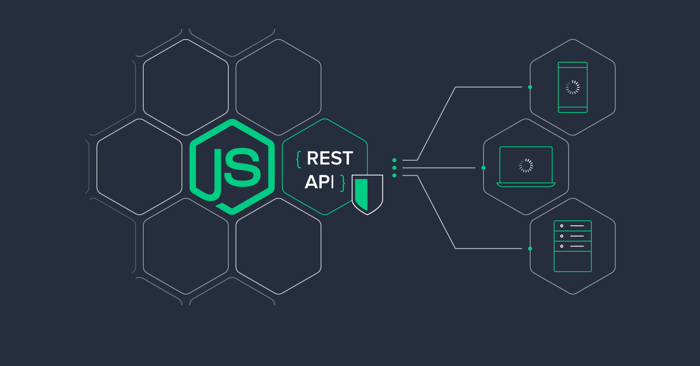

# Tech School em construção... 🚧

  

## Tecnologias

Esse projeto está sendo desenvolvido com as seguintes tecnologias:

- [Docker](https://www.docker.com/)
- [NodeJs](https://nodejs.org/)
- [Express](https://expressjs.com/)
- [Sequelize](https://sequelize.org/)

## Projeto

API de uma aplicação para gerenciar alunos e cursos da sua escola de tecnologia. Em construção... 🚧

## Como executar

- Faça o download do [Docker](https://www.docker.com/) para rodar o banco de dados
- Clone o repositório `git clone git@github.com:sergiovieirawebb/tech-school.git`
- Rode o `npm install` para baixar as dependências
- Rode o `docker-compose up -d` para iniciar o banco de dados pelo docker
- Rode o `npm run database` para criar as tabelas do banco de dados
- Rode o `npm run dev` para iniciar a aplicação

Por fim, a aplicação estará disponível em `http://localhost:3001/courses`

## Licença

Esse projeto foi criado por [Sérgio Vieira](https://www.linkedin.com/in/sergiovieirawebb/) - Desenvolvedor Back-end. E está sob a licença MIT,   veja o arquivo [LICENSE](./LICENSE.md) para mais detalhes... :rocket:
